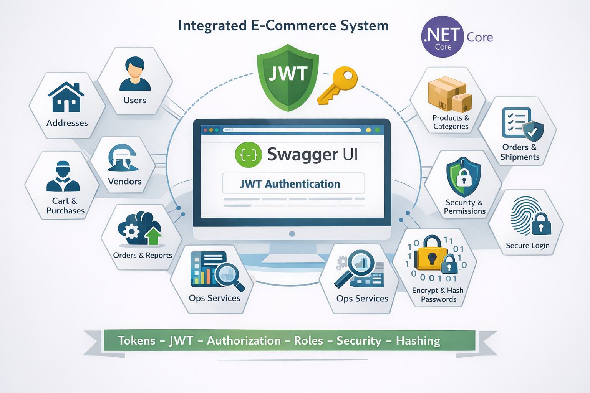

# ShoppingPlatformBackend

Integrated E-Commerce Backend built with ASP.NET Core, Entity Framework, JWT Authentication, Role-Based Authorization, and Swagger API Documentation.


## Architecture




---

## Features ✅
- Users management with JWT Authentication
- Role-based Authorization (CUSTOMER, OPS, ADMIN)
- Address management
- Vendors, Categories, and Products
- Cart & CartItems
- Orders, SubOrders & SubOrderItems
- OrderStatusLogs with full audit trail
- Password hashing using BCrypt
- Swagger API documentation with JWT support

---

## Requirements
- [.NET 7 SDK](https://dotnet.microsoft.com/en-us/download/dotnet/7.0)
- SQL Server (LocalDB or full edition)
- Visual Studio 2022 / VS Code
- NuGet packages (installed automatically):
  - Microsoft.EntityFrameworkCore
  - Microsoft.EntityFrameworkCore.SqlServer
  - Microsoft.EntityFrameworkCore.Tools
  - Microsoft.AspNetCore.Authentication.JwtBearer
  - System.IdentityModel.Tokens.Jwt
  - BCrypt.Net-Next
  - Swashbuckle.AspNetCore

---

## Setup Instructions

### 1. Clone the repository
```bash
git clone https://github.com/sajjadbassim/ShoppingPlatformAPI.git
cd ShoppingPlatformAPI
